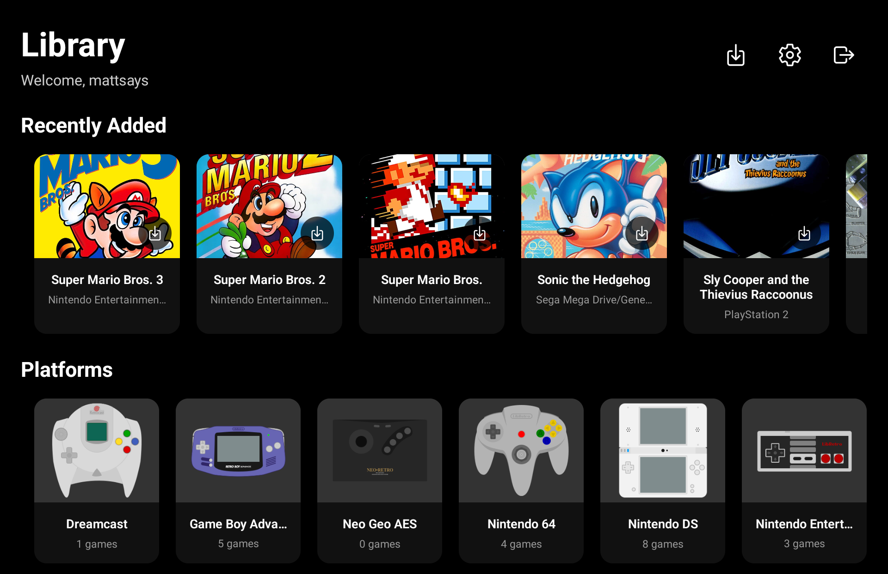
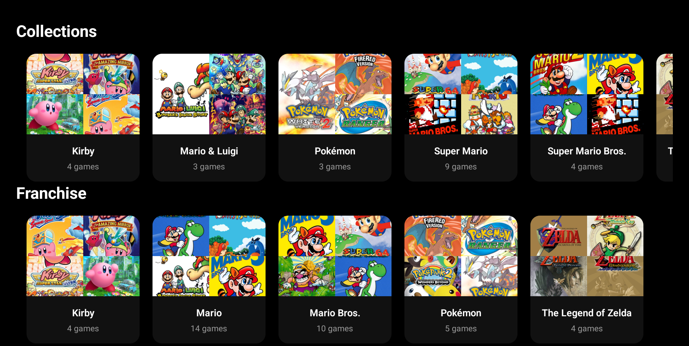
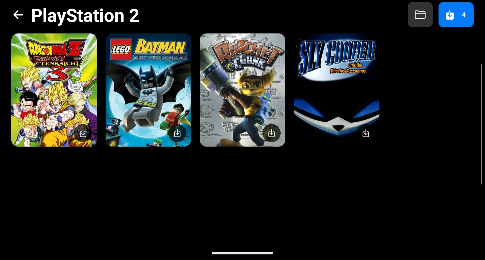

# RomM Android

<div align="center">
  
  
  <p><strong>A React Native companion app for RomM - ROM Management made easy</strong></p>
  
  [](https://expo.dev/)
  [](https://reactnative.dev/)
  [](https://www.typescriptlang.org/)
</div>

## 📱 About

RomM Android is a mobile companion app for [RomM](https://github.com/rommapp/romm), a beautiful, powerful, self-hosted ROM manager. This app allows you to browse, manage, and organize your retro gaming collection directly from your Android device.

### ✨ Features

- 🎮 **Browse ROM Collections**: Explore your games organized by platform
- 🔐 **Secure Authentication**: Login with your RomM server credentials
- 📱 **Retrohandled-Optimized Interface**: Beautiful, responsive design built for retrohandleds
- 📁 **File Management**: Download and manage ROM files on your device

## 📸 Screenshots

<div align="center">
  <table>
    <tr>
      <td align="center">
        
        <br>
        <em>Library & Recently Added</em>
      </td>
      <td align="center">
        
        <br>
        <em>Collections View</em>
      </td>
      <td align="center">
        
        <br>
        <em>Platform ROMs</em>
      </td>
    </tr>
  </table>
</div>

## 🚀 Getting Started

### Installation
1. **Download the APK**: Get the latest release from the [Releases page](https://github.com/mattsays/romm-android/releases)
2. **Install the APK**: Enable installation from unknown sources in your Android settings, then install the downloaded APK
3. **Open the App**: Launch RomM Android and log in with your RomM server credentials.

## 📁 How To - Folder Management

RomM Android uses a sophisticated folder management system that allows you to organize your ROM files efficiently. Here's how it works:

### Overview

The app manages folders in two main ways:
- **Platform-specific folders**: Each gaming platform (NES, SNES, PlayStation, etc.) can have its own dedicated folder
- **Automatic folder selection**: When you download your first ROM for a platform, the app will prompt you to select a folder

### How Folder Management Works

#### 1. **First-time Setup**
When you download your first ROM for any platform:
1. The app checks if a folder is already configured for that platform
2. If no folder exists, it automatically prompts you to select one
3. You'll see a dialog asking you to choose a folder for that specific platform
4. Once selected, all future ROMs for that platform will be saved in the same folder

#### 2. **Folder Configuration**
- **Automatic**: Prompted when downloading first ROM of a platform
- **Manual**: Configure folders in Settings → Platform Folders
- **Per-platform**: Each platform can have its own unique folder
- **Flexible**: You can change folder locations anytime

#### 3. **Storage Access Framework (SAF)**
The app uses Android's Storage Access Framework which:
- ✅ Works with any storage location (internal, SD card, cloud storage)
- ✅ Maintains permissions across app updates
- ✅ Provides secure access to your files
- ✅ No need for broad storage permissions

### Managing Folders

#### In Settings
Navigate to **Settings → Platform Folders** to:
- View all configured platform folders
- Change folder location for any platform
- Remove folder configuration for a platform
- Remove all platform folder configurations

#### During Download
When downloading a ROM:
1. App checks if platform folder exists
2. If exists: ROM downloads directly to that folder
3. If missing: Shows folder selection dialog
4. Selected folder is saved for future downloads of that platform

#### Folder Selection Dialog
The folder selection dialog shows:
- **Current folder** (if one is already configured)
- **Platform name** you're configuring
- Options to **Change** or **Cancel**

### Key Features

#### Smart File Detection
- Automatically detects if a ROM is already downloaded
- Prevents duplicate downloads


## 🔧 Development


### Prerequisites

- [Node.js](https://nodejs.org/) (version 18 or higher)
- [Expo CLI](https://docs.expo.dev/get-started/installation/)
- Android Studio (for Android development)
- A running [RomM server](https://github.com/rommapp/romm)

### Installation


1. **Clone the repository**
   ```bash
   git clone https://github.com/mattsays/romm-android.git
   cd romm-android
   ```

2. **Install dependencies**
   ```bash
   npm install
   ```

3. **Start the development server**
   ```bash
   npm start
   ```

4. **Run on Android**
   ```bash
   npm run android
   ```

### Project Structure

```
romm-android/
├── app/                    # Expo Router pages
│   ├── auth/              # Authentication screens
│   ├── game/              # Game detail screens
│   └── platform/          # Platform browsing screens
├── components/            # Reusable React components
├── contexts/              # React contexts (AuthContext)
├── hooks/                 # Custom React hooks
├── locales/               # Internationalization files
├── services/              # API services and utilities
└── assets/                # Images, fonts, and static assets
```

### Available Scripts

- `npm start` - Start the Expo development server
- `npm run android` - Run on Android device/emulator

### Technology Stack

- **Framework**: [Expo](https://expo.dev/) with Expo Router
- **Language**: TypeScript
- **UI**: React Native with custom components
- **Navigation**: Expo Router (file-based routing)
- **State Management**: React Context + Custom Hooks
- **Storage**: Expo SecureStore for sensitive data
- **HTTP Client**: Fetch API with custom wrapper
- **Internationalization**: Custom i18n implementation

## 📋 Requirements

### Android Permissions

The app requires the following permissions:
- `READ_EXTERNAL_STORAGE` - Access ROM files
- `WRITE_EXTERNAL_STORAGE` - Download and save ROMs
- `INTERNET` - Connect to RomM server

### RomM Server Compatibility

This app is compatible with RomM API version 3.10.2 and above.

## 🔒 Security

- All authentication tokens are stored securely using Expo SecureStore
- HTTPS connection to RomM server is recommended for production use
- No sensitive data is logged or cached in plain text

## 🤝 Contributing

We welcome contributions! Please feel free to submit a Pull Request. For major changes, please open an issue first to discuss what you would like to change.

### Development Guidelines

1. Follow the existing code style and TypeScript patterns
2. Add appropriate types for all new code
3. Test your changes on both Android devices and emulators
4. Update documentation as needed

## 📄 License

This project is licensed under the MIT License - see the [LICENSE](LICENSE) file for details.

## 🔗 Related Projects

- [RomM](https://github.com/rommapp/romm) - The main RomM server application
- [RomM Documentation](https://github.com/rommapp/romm/wiki) - Official documentation

## 📞 Support

- 🐛 **Bug Reports**: [GitHub Issues](https://github.com/mattsays/romm-android/issues)
- 💬 **Discussions**: [GitHub Discussions](https://github.com/mattsays/romm-android/discussions)
- 📖 **Documentation**: [Wiki](https://github.com/mattsays/romm-android/wiki)

## 🙏 Acknowledgments

- [RomM Team](https://github.com/rommapp/romm) for creating the amazing ROM management platform
- [Expo Team](https://expo.dev/) for the excellent React Native development experience
- The retro gaming community for inspiration and feedback

---

<div align="center">
  <p>Made with ❤️ for the retro gaming community</p>
</div>